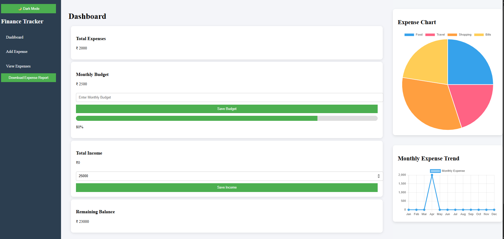
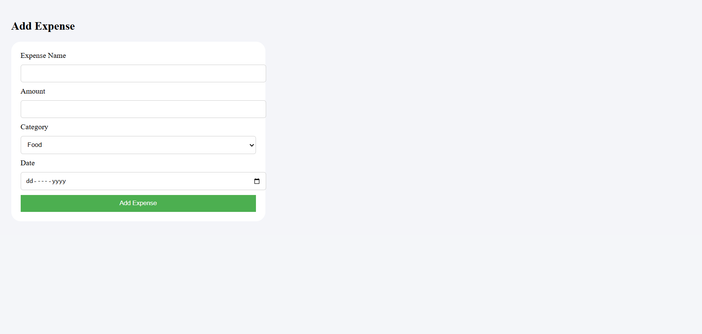
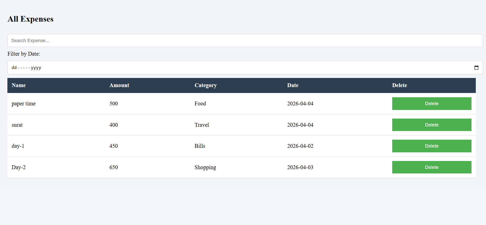
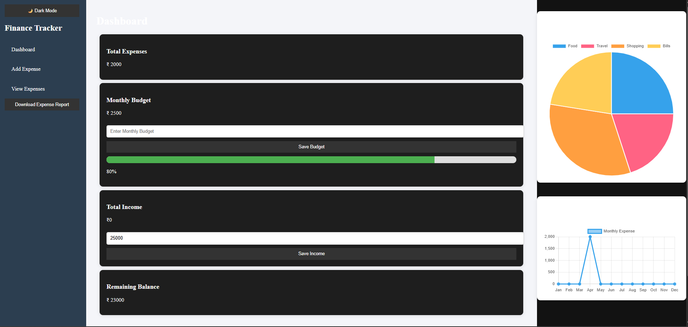

# 💰 Personal Finance Tracker

## 📌 Overview

Personal Finance Tracker is a simple and user-friendly web application that helps users manage their daily expenses and track their financial activities.  
The application allows users to add expenses, manage total income, calculate remaining balance, visualize spending using charts, and export data as a CSV file.

This project is built using basic web technologies and is designed with a clean and mobile-responsive user interface.

---

## ✨ Features
✅ Add daily expenses  
✅ View all expenses in a list  
✅ Delete expenses  
✅ Set and save total income  
✅ Automatic remaining balance calculation  
✅ Expense visualization using charts  
✅ Export expense data as CSV file  
✅ Data stored using Local Storage  
✅ Mobile-friendly responsive UI  

---

## 🛠️ Technologies Used

- HTML5
- CSS3
- JavaScript (Vanilla JS)
- Chart.js
- Browser LocalStorage

---

## 📂 Project Structure

```
finance-tracker/
│
├── index.html          # Dashboard page
├── add-expense.html    # Add expense page
├── expenses.html       # Expense list page
├── style.css           # Styling file
├── script.js           # JavaScript logic
└── README.md
```

---

## 📱 Screenshots

### Home Page / Dashboard


### Add Expense Page


### View Expense Page


### Dark Mode Theme Chage 


> Note: Create an `images` folder and add screenshots there.

---

## 🚀 How to Run the Project

1. Download or clone the repository

```
git clone https://github.com/niravhingu/finance-tracker.git
```

2. Open the project folder

3. Open `index.html` in any web browser

That’s it 🎉 — the application will run locally.

---

## 📊 How It Works

- User enters total income.
- Expenses are added and stored in browser LocalStorage.
- Remaining balance updates automatically.
- Chart displays expense distribution visually.
- CSV export allows downloading expense records.

---

## 🔮 Future Improvements

- User login system
- Cloud database integration
- Expense categories
- Dark mode
- Monthly reports
- Data backup featur
- ## For now, this is only capable of running on desktops, but a mobile-friendly interface will also be available soon.

---

## 🎯 Learning Outcomes

This project helped in understanding:

- DOM Manipulation
- Event Handling
- Local Storage usage
- Responsive UI Design
- JavaScript logic building
- Chart integration

---

## 🤝 Contribution

Contributions, suggestions, and improvements are welcome.

1. Fork the repository
2. Create a new branch
3. Make changes
4. Submit a pull request

----

## 👨‍💻 Author

**Nirav Hingu**

GitHub: https://github.com/niravhingu

---

## ✅ Conclusion

Personal Finance Tracker demonstrates how basic web technologies can be used to build a practical real-world application.  
It provides an easy way to manage finances while showcasing frontend development concepts like storage handling, charts, and responsive design.

---
